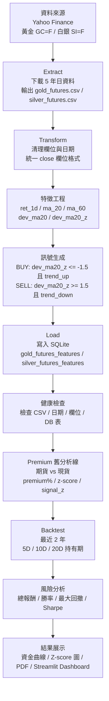

```mermaid
flowchart TD
    A[資料來源<br/>Yahoo Finance<br/>黃金 GC=F / 白銀 SI=F] --> B[Extract<br/>下載 5 年日資料<br/>輸出 gold_futures.csv / silver_futures.csv]
    B --> C[Transform<br/>清理欄位與日期<br/>統一 close 欄位格式]
    C --> D[特徵工程<br/>ret_1d / ma_20 / ma_60<br/>dev_ma20 / dev_ma20_z]
    D --> E[訊號生成<br/>BUY: dev_ma20_z <= -1.5 且 trend_up<br/>SELL: dev_ma20_z >= 1.5 且 trend_down]
    E --> F[Load<br/>寫入 SQLite<br/>gold_futures_features / silver_futures_features]
    F --> G[健康檢查<br/>檢查 CSV / 日期 / 欄位 / DB 表]
    G --> H[Premium 舊分析線<br/>期貨 vs 現貨<br/>premium% / z-score / signal_z]
    H --> I[Backtest<br/>最近 2 年<br/>5D / 10D / 20D 持有期]
    I --> J[風險分析<br/>總報酬 / 勝率 / 最大回撤 / Sharpe]
    J --> K[結果展示<br/>資金曲線 / Z-score 圖 / PDF / Streamlit Dashboard]
```